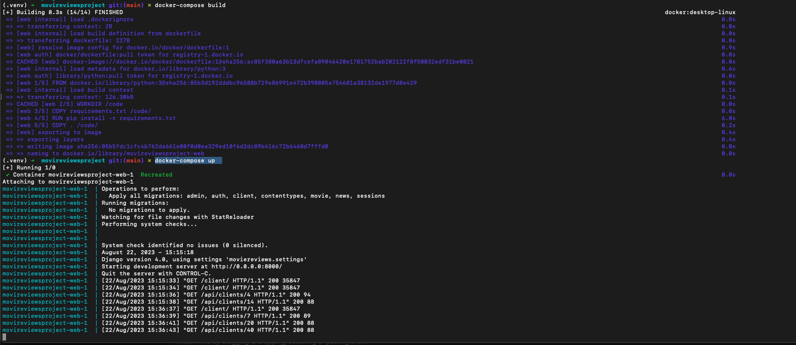

# Sample Django Project 

### Steps to Run
```
docker-compose build
docker-compose up  
```
Output from these commands will look like this



Open the browser and navigate to http://127.0.0.1:8000/client/ to see the example running
